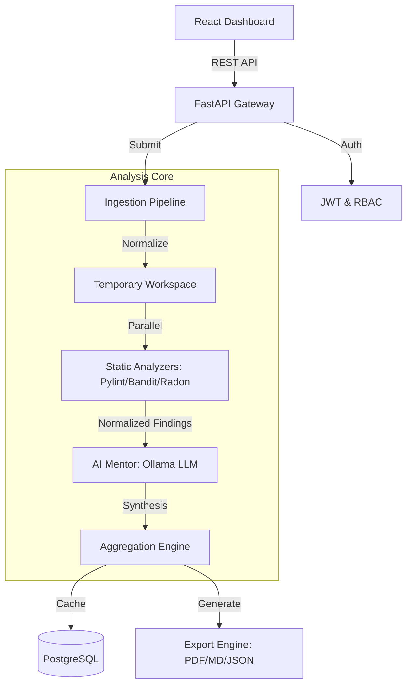

# CodeSage 🛡️

**AI-Powered Code Review Platform for Modern Developers.**

CodeSage is a professional-grade tool designed to automate and enhance the software code review process. It bridges the gap between deterministic static analysis and heuristic AI reasoning, acting as a "Senior Developer in a Box" to help developers write cleaner, safer, and more maintainable Python code.

---

## 🚀 Key Features

- **Hybrid Analysis Engine:** Combines trusted static tools (**Pylint, Bandit, Radon**) with Local LLMs (**Ollama**) for multi-layered insights.
- **AI Mentor:** Receives educational summaries and actionable refactoring recommendations instead of just "fixing bugs."
- **Command Center Dashboard:** Tracks project health over time with quality trends and severity distributions.
- **Unified Submission Pipeline:** Ingest code via raw paste, ZIP upload, or direct GitHub repository cloning.
- **Professional Artifacts:** Generate and export review reports in **PDF, Markdown, and JSON** formats.
- **Graceful Degradation:** Resilient architecture that delivers static results even if AI services are offline.
- **Enterprise-Ready Infrastructure:** Includes JWT authentication, RBAC, audit logging, and structured observability.

---

## 🏗️ Architecture Overview

CodeSage follows **Clean Architecture** principles, strictly separating business logic from frameworks and external providers.



---

## 🛠️ Technology Stack

- **Backend:** Python 3.12, FastAPI, SQLAlchemy (ORM), Alembic (Migrations)
- **Frontend:** React 18, Vite, Tailwind CSS, TanStack Query, Recharts
- **Database:** PostgreSQL
- **AI Engine:** Ollama (Llama 3)
- **Tooling:** Ruff (Linting/Formatting), Pytest (Testing), ReportLab (PDF)

---

## 💻 Local Setup

### Prerequisites
- Python 3.12+
- Node.js 18+
- [Ollama](https://ollama.com/) (installed and running)
- PostgreSQL

### 1. Clone & Foundation
```bash
git clone https://github.com/pranalibuilds-gif/code-review-assistant.git
cd code-review-assistant
cp .env.example .env # Update with your DB credentials
```

### 2. Backend Setup
```bash
cd backend
python -m venv .venv
source .venv/bin/activate # or .venv\Scripts\activate on Windows
pip install -r requirements.txt
alembic upgrade head
python scripts/seed_admin.py # Creates admin@codesage.local / Demo2026!
python app/main.py
```

### 3. Frontend Setup
```bash
cd frontend
npm install
npm run dev
```

---

## 🏗️ Project Structure

```text
CodeSage/
├── backend/            # FastAPI, SQLAlchemy, Analysis Logic
├── frontend/           # React, Vite, Tailwind Dashboard
├── docs/               # Technical Deep-Dives & Diagrams
├── demo/               # Sample Reports & Seed Scripts
├── tests/              # Pytest Suite (Unit & Integration)
└── README.md           # This Page
```

## 📊 Demo & Verification
To verify the application with a realistic dataset, run the demo data generator:
```bash
python demo/sample_data/seed.py --profile enterprise --reset
```
This will populate your local database with a realistic enterprise dataset and seed the default admin/demo accounts.

---
*Developed as a portfolio-quality engineering project during a software engineering internship.*
