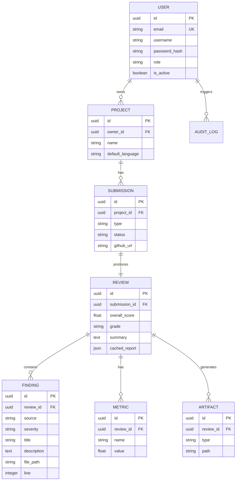

# Database Design

CodeSage uses a relational model optimized for project-level grouping and historical trend tracking.

## Entity Relationship Diagram

## Optimization Strategies

- **UUID Primary Keys:** Used for all tables to prevent ID enumeration and simplify distributed scaling.
- **Indexes:** 
  - `ix_users_email`
  - `ix_projects_owner_id`
  - `ix_findings_review_id`
- **Cached Report:** The `Review` table stores a complete JSON snapshot of the aggregated analysis. This allows the Frontend to render complex dashboards and reports with a single indexed primary key lookup, avoiding heavy joins during read operations.
