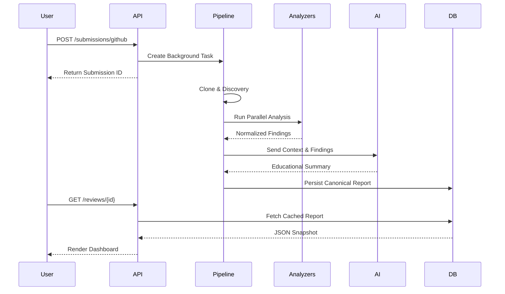

# System Overview

CodeSage is designed as a **modular, service-oriented system** that prioritizes maintainability and replaceability.

## Core Philosophies

1. **Clean Architecture:** Business logic (the "Domain") does not depend on external libraries or frameworks. This allows us to swap FastAPI for another framework or replace Ollama with OpenAI with minimal impact.
2. **Deterministic vs. Heuristic:** We combine the reliability of deterministic tools (Pylint) with the contextual reasoning of heuristic tools (LLMs).
3. **Everything is Data:** Every analysis output is normalized into a unified schema before it reaches the synthesis stage.
4. **Observable by Default:** Every request is traced via a `Request ID` and logged in a structured JSON format.

## Layer Separation

### 1. API Layer (Gatekeeper)
- Routes requests and validates inputs using Pydantic.
- Handles Auth/RBAC.
- Formats consistent JSON responses.

### 2. Service Layer (Orchestrator)
- Implementation of business capabilities.
- Coordinates between Repositories and Infrastructure providers.
- Examples: `SubmissionService`, `AggregationService`.

### 3. Domain Layer (The Brain)
- Defines the core entities: `Project`, `Review`, `Finding`.
- Contains pure logic like `ScoringService`.

### 4. Infrastructure Layer (Adapters)
- Communicates with external systems: Database, Ollama, OS Filesystem, Git.
- Implements the "Adapters" for the Static Analyzers.

## Request Lifecycle

